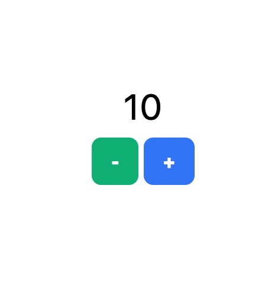

# Learning Stimulus - Example 01

Basic counter example with pure/vanilla JavaScript that includes what I’ve
learned from [egghead.io][link]

---

## Contributer(s)

* [Uğur "vigo" Özyılmazel](https://github.com/vigo) - Creator, maintainer

---

## Contribute

All PR’s are welcome!

1. `fork` (https://github.com/vigo/learning-stimulus-01/fork)
1. Create your `branch` (`git checkout -b my-feature`)
1. `commit` yours (`git commit -am 'Add XXX feature'`)
1. `push` your `branch` (`git push origin my-feature`)
1. Than create a new **Pull Request**!

---

## License

This project/example code is licensed under MIT

[link]: https://egghead.io/lessons/javascript-update-stimulusjs-state-with-actions-getters-and-setters

